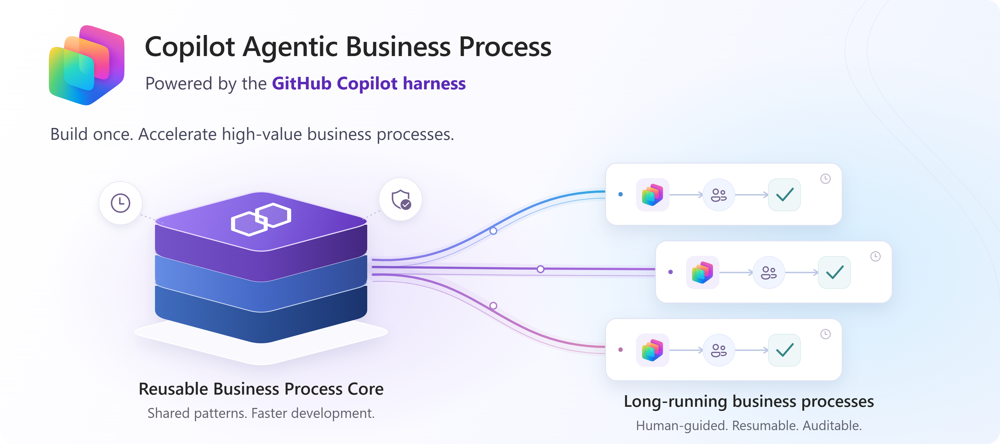
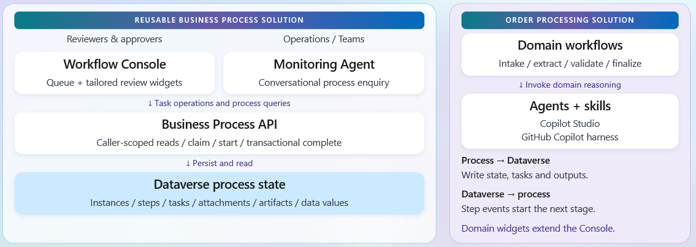
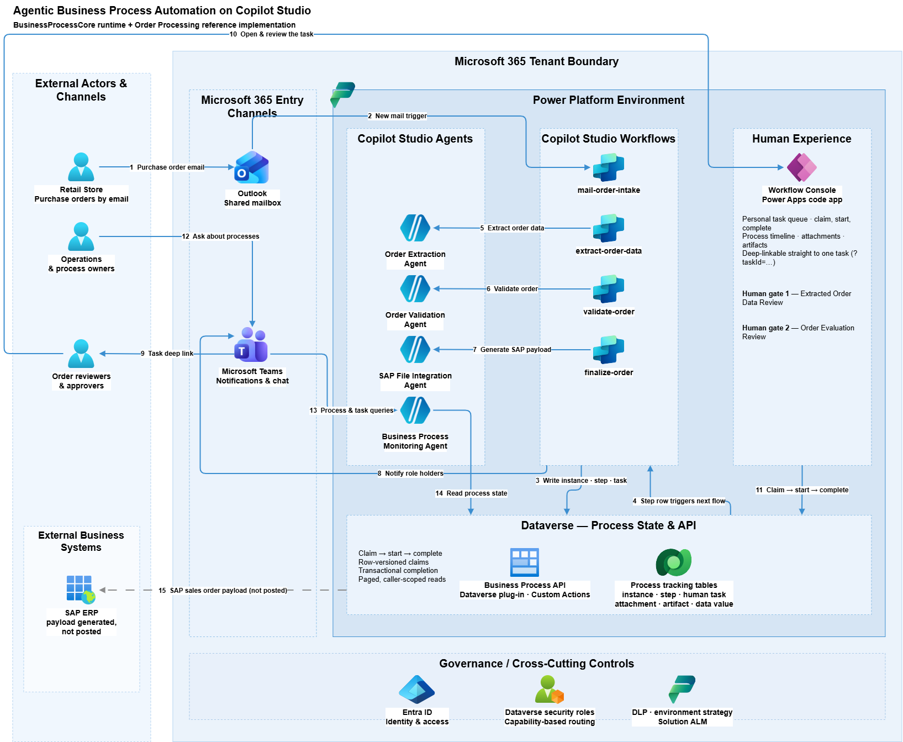
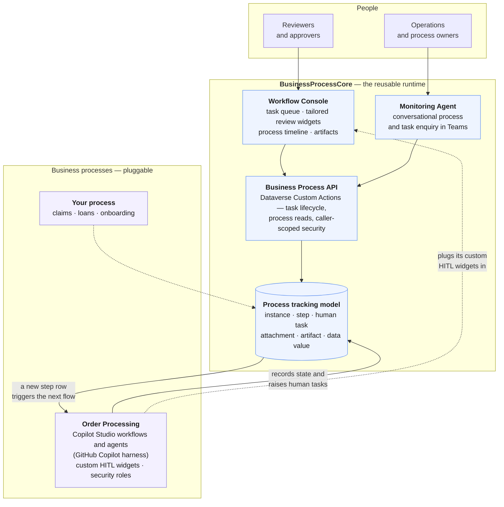

# Agentic Business Process Automation on Copilot Studio

Copilot Studio makes it easy to build an agent. It does not, on its own, give you a
**business process**  : a long-running, resumable, auditable unit of work that spans
multiple agents and flows, pauses for days waiting on a human decision, and can still
answer "where is this case, who is sitting on it, and what did the agent actually
decide?" three weeks later. The case may be an order, a claim, a loan application, a
deal, an onboarding request — the mechanics are the same every time.

Every maker who tries to build one ends up reinventing the same plumbing — a state
table, a task queue, a review UI, a notification fan-out, a way to resume a flow after
a human clicks Approve. This repository provides that plumbing as a reusable agentic business process building block that you can deploy as solution in your enviroment.

This repo also comes with business specific scenarios implementation that serve as reference implementations for how to use the core building blocks in real-world processes.

It is built on the most capable engine Copilot Studio offers [**GitHub Copilot harness**](https://learn.microsoft.com/microsoft-copilot-studio/harnesses-overview#github-copilot-harness)
— the reasoning-heavy runtime designed for exactly this class of work. 

The harness also unlocks what this solution treats as its unit of business logic:
[**agent skills**](https://learn.microsoft.com/microsoft-copilot-studio/agents-experience/skills-overview)
— portable Markdown packages of instructions, references and scripts that each hand an
agent one body of business rules, loaded into context only when a task actually calls for
them. Business logic becomes reviewable, versionable content a domain expert can correct,
and agents stay accurate as the rule base grows instead of degrading under one
ever-longer prompt.

[BUSINESS SCENARIO](#business-scenario) | [SOLUTION OVERVIEW](#solution-overview) | [QUICK DEPLOY](#quick-deploy) | [SUPPORTING DOCUMENTATION](#supporting-documentation)

> [!NOTE]
> With any AI solution you create using these templates, you are responsible for assessing
> all associated risks and for complying with all applicable laws and safety standards.
> Learn more in the transparency documents for
> [Microsoft Copilot Studio](https://learn.microsoft.com/microsoft-copilot-studio/responsible-ai-overview)
> and [agents in sensitive domains](https://learn.microsoft.com/azure/ai-foundry/responsible-ai/agents/transparency-note).

<h2> Business scenario</h2>

**BusinessProcessCore** is a process-agnostic runtime for agentic business processes on
Power Platform. It ships:

- a **Dataverse process-tracking data model** — process instances, steps, human tasks,
  incoming attachments, generated artifacts, and typed key/value process data — so state
  and audit trail are a schema, not a JSON blob in a flow variable;
- a **Business Process API**: a Dataverse plug-in exposing Custom Actions for the task
  lifecycle (claim → start → complete) with transactional completion, optimistic
  concurrency, and caller-scoped security, so two reviewers can never complete the same
  task twice;
- a **Workflow Console**: a Power Apps code app giving every user a task queue, a
  deep-linkable review experience with use-case-tailored review widgets, and a full
  timeline of any process instance;
- a **human-in-the-loop pattern** built on Dataverse security roles — tasks route to a
  *capability* rather than a named person, eligible users are notified in Teams, and the
  flow resumes from the task outcome;
- a **Business Process Monitoring Agent** for Copilot Studio, so operations can ask about
  running processes, stuck steps, and open tasks conversationally in Teams.

Makers build **on top of** this core. A new business process contributes its own flows,
its own Copilot Studio agents, its own review widgets and security roles — and inherits
state management, human tasks, auditability, and monitoring for free.

Current available reference implementations:
- [Order Processing](business-processes/order-processing/README.md): purchase orders arrive as email attachments, agents extract and validate them against catalog, inventory,
and promotion data, two human gates approve the result, and a final agent emits an
SAP-ready sales order.

- **Car Insurance Claim Processing**: car insurance claims arrive as email attachments, agents extract car incident images, provide a damage assessment and validate them against policy and claim data, two human gates approve the result, and a final agent emits a claim settlement. This scenario is working in progress.

### Key Features

Click to learn more about the capabilities the core provides to every process built on it.

<b>Long-running processes that survive human latency </b>

A flow never calls the next flow. Each one ends by writing a process step row to
Dataverse, and the next flow is triggered by that row. There is no orchestrator to keep
alive, no timeout to work around, and no in-flight state to lose: a process can wait days
for a decision, fail mid-stage, and resume exactly where it stopped.

<b>Human-in-the-loop routed by capability, not by name</b>

A task targets a Dataverse **security role** rather than a person or a mailbox. The
runtime resolves the role at execution time, finds every enabled user who holds it
directly, inherits it through a team, or belongs to a named team, notifies each of them
in Teams, and lets the first one claim it. Staff changes, holidays, and reorganisations
require no change to any flow.

<b>A task queue with real concurrency semantics</b>

Claim, start, and complete are Dataverse Custom Actions, not flow steps. Claims use
row-version checks so the first committed claimant wins; completion runs in a single
transaction that writes the outcome, the widget outputs, and the step closure together,
or writes nothing at all. Two reviewers cannot complete the same task twice.

<b>A rich human-in-the-loop experience, tailored to each use case</b>

Approve/reject buttons in a chat window are not enough when the human has to check what
an agent read from a scanned document, correct three line items, and sign off on a
pricing decision. The Workflow Console renders a **use-case-tailored widget** for each
task: the task carries a widget name and a JSON payload, and the console maps that name
to a purpose-built React component — a side-by-side document and data reviewer, an
evaluation sign-off, a structured data form. Each process ships the review experience its
users actually need, and inherits routing, claiming, submission, validation, and error
handling unchanged. Unrecognised widgets fall back to a raw JSON editor rather than
breaking.

<b>Business logic exposed as Dataverse Custom APIs</b>

Process and task access is a versioned API surface — paged reads with opaque
continuation tokens, caller-scoped security, and typed contracts — consumed unchanged by
the Workflow Console, by the monitoring agent, and by any flow or agent you add. All
access runs as the effective caller, so Dataverse row and column security remain
authoritative.

<b>An audit trail by construction</b>

Every step, human task, incoming attachment, generated artifact, and typed output is a
row with its own timestamps, actor, and status. Answering "what did the agent decide, who
approved it, and what did the customer actually send us" is a query, not a forensic
exercise across run histories that expire.

<b>Conversational process monitoring in Teams</b>

A Copilot Studio monitoring agent ships with the core, wired to the same APIs, so
operations can ask about running processes, stuck steps, open tasks, artifacts, and
assignments in natural language instead of opening a maker portal.

<b>Agent-driven deployment</b>

The repository ships deployment skills for GitHub Copilot. Ask Copilot to deploy, and it
runs a readiness report, checks roles, licences, and environment features, and stops
before touching anything that is not ready — or follow the same steps by hand from the
deployment guides.

<h2> Solution overview</h2>

The core owns **state, identity, and experience**. A business process owns **its own
logic**. The two meet at the process tracking model: a workflow records what it did as a
step, and the creation of that step is what triggers whatever runs next. Nothing in the
core knows that orders exist, and nothing in Order Processing implements a task queue.

### Core components

| Component | What it provides | Source |
| --- | --- | --- |
| **Process tracking model** | Six Dataverse tables — process instance, step, human task, attachment, artifact, and typed data value — with parental cascades so deleting a run removes its whole trace, and an alternate key allowing flows to upsert process data by name without a pre-read. | [Specification](core/spec/business-process-data-model-spec.md) |
| **Business Process API** | A Dataverse plug-in exposing the task lifecycle and process reads as Custom Actions. Claims are row-versioned so the first claimant wins; completion is a single transaction across task, outputs, and step. Reads are paged with opaque continuation tokens and run as the effective caller. | [API contract](core/plugins/business-process-api/README.md) |
| **Workflow Console** | A Power Apps code app: personal task queue, a use-case-tailored review widget per task, the full step timeline of any process instance, and access to its attachments, artifacts, and outputs. Launchable by deep link straight to a single task. | [Console guide](core/codeapps/workflow-console/README.md) |
| **Monitoring Agent** | A Copilot Studio agent wired to the same Custom Actions and tables, so process owners can ask about running instances, stuck steps, open tasks, and assignments from Teams. | [Core solution](core/solution/DEPLOYMENT.md) |
| **Security and configuration** | A least-privilege runtime security role for the service identity, role-based task routing, and the environment variable that lets any flow build a Workflow Console deep link. | [Core solution](core/solution/DEPLOYMENT.md) |

<b>Business Core Architecture Diagram</b>

All of it ships as one Power Platform solution, `BusinessProcessCore`, installed once per
environment.

> [!IMPORTANT]
> Every agent and agent workflow in this repository — the monitoring agent included — is
> built with the **GitHub Copilot harness in Copilot Studio**, which is what makes agent
> skills and knowledge files available as the authoring model. Building, testing, and
> running them consumes **Copilot Credits**, funded through prepaid capacity or
> pay-as-you-go billing; a Microsoft 365 Copilot licence does not cover this consumption.
> See [Copilot Studio usage-based billing](https://learn.microsoft.com/microsoft-copilot-studio/agents-experience/billing-credit-overview).

### How a business process plugs in

A business process is its own solution, layered on the installed core. It contributes
four things and inherits the rest.

| Contributed by the process | Inherited from the core |
| --- | --- |
| **Copilot Studio workflows** — one per stage, each triggered by a step row and ending by writing the next one | Process state, step history, and the trigger mechanism itself |
| **Copilot Studio agents** — the domain reasoning, with their skills and knowledge files | Agent-to-process plumbing: every result lands as a typed process data value |
| **Review widgets** — the React components that render its human tasks | Task queue, claiming, concurrency, submission, notification, and deep linking |
| **Security roles and environment variables** — who may act, and where the process reads its configuration | Role resolution, eligible-user discovery, and Teams notification |

The contract between the two is deliberately small: **write a step row, and something
happens next.** A flow does not call another flow, does not hold state, and does not need
to know who will act on a task it raises.

[Order Processing](business-processes/order-processing/README.md) demonstrates the full
pattern end to end — four flows, two agents, two widgets, two roles — and is the template
to copy when adding your own.

### Technology stack

| Layer | Technology |
| --- | --- |
| Process state and audit trail | Microsoft Dataverse |
| Process and task API | Dataverse plug-in (C#, .NET) exposing Custom Actions |
| Stage orchestration | Copilot Studio workflows |
| Reasoning and document understanding | Microsoft Copilot Studio agents on the GitHub Copilot harness, with agent skills and knowledge files |
| Human experience | Power Apps code app — React, TypeScript, Vite, Tailwind CSS, TanStack Query |
| Notification and conversational access | Microsoft Teams |
| Deployment and automation | Power Platform CLI, PowerShell 7, Python, and GitHub Copilot deployment skills |

<h2> Quick deploy</h2>

Deployment happens in two stages: install **BusinessProcessCore** once per environment,
then install each business process on top of it.

You do not have to work through either by hand. This repository ships
[GitHub Copilot skills](.github/skills/) that automate the whole thing — provisioning or
reusing a Dataverse environment, creating the runtime identity, importing the solutions,
wiring connections, and verifying the result.

### Deploy with GitHub Copilot

Open the repository in VS Code with GitHub Copilot and ask for what you want:

| Ask for | Skill | What it does |
| --- | --- | --- |
| "Deploy Business Process Core" | `deploy-business-process-core` | Uses the Dataverse environment you name, or provisions a new one. Installs the tooling prerequisites, creates the least-privilege security role, the Entra application and its Dataverse application user, and the Dataverse connection; generates the deployment settings; imports and publishes the solution; repairs the monitoring agent's tool associations; grants table privileges; sets the Workflow Console URL; then verifies every component. |
| "Deploy Order Processing" | `deploy-order-processing` | Verifies or installs the core first, provisions the automation identity and shared mailbox, imports the solution, activates its workflows, and assigns the reviewer and approver roles. |

Each skill runs a **readiness report before touching anything**, summarises the access,
licences, and credits the deployment will need, and requires your explicit confirmation
before it proceeds. It stops on anything that is not ready rather than half-installing.
At the end it hands back a deployment summary: environment and organization IDs, solution
versions, application user and connection IDs, role verification, and the Workflow
Console URL.

Prefer to do it yourself? The same steps are written out in the
[Core deployment guide](core/solution/DEPLOYMENT.md) and the
[Order Processing deployment guide](business-processes/order-processing/solution/DEPLOYMENT.md).

### Tooling prerequisites

[Power Platform CLI](https://learn.microsoft.com/power-platform/developer/howto/install-cli-msi),
[Azure CLI](https://learn.microsoft.com/cli/azure/install-azure-cli),
[PowerShell 7](https://github.com/powershell/powershell), and
[Python 3.11+ with uv](https://github.com/astral-sh/uv). Node.js and the .NET SDK are
needed only if you intend to modify the Workflow Console or the Dataverse plug-in. The
deployment skills install and verify these for you.

### Access and licensing for the core

| Access | Needed for |
| --- | --- |
| **System Administrator** in the target Dataverse environment | Importing the solution, configuring roles, application users, and environment variables |
| **Entra app-registration rights** (Application Developer, or Cloud Application Administrator) | Creating the runtime identity used by the solution |
| **Power Platform Administrator** | Only when a new environment has to be provisioned |

| Licence | Who needs it |
| --- | --- |
| **Power Apps Premium** | Anyone using the Workflow Console |
| **Copilot Studio user licence** | Makers authoring or publishing the agents |
| **Microsoft Teams** | Anyone using the monitoring agent or receiving task notifications |
| **Copilot Credits** | Building, testing, and running everything on the GitHub Copilot harness — prepaid capacity or pay-as-you-go |

Each business process adds its own requirements on top of these. For the reference
implementation, see
[Order Processing — before you deploy](business-processes/order-processing/README.md#before-you-deploy).

> [!TIP]
> To avoid ongoing consumption, delete the environment or uninstall the solutions when
> you are done evaluating.

<h2> Supporting documentation</h2>

| Document | What it covers |
| --- | --- |
| [Process tracking data model](core/spec/business-process-data-model-spec.md) | Every table, column, choice, relationship, and the design decision behind each |
| [Business Process API contract](core/plugins/business-process-api/README.md) | Request, response, authorization, paging, and mutation contracts for the Custom Actions |
| [Plug-in development guide](core/plugins/business-process-api/DEVELOPMENT.md) | Building, testing, packaging, and registering the Dataverse plug-in |
| [Workflow Console guide](core/codeapps/workflow-console/README.md) | Developing, testing, and deploying the code app |
| [Core deployment guide](core/solution/DEPLOYMENT.md) | The full BusinessProcessCore installation procedure |
| [Order Processing](business-processes/order-processing/README.md) | The reference implementation, its workflows, agents, and prerequisites |

### Security guidelines

> [!IMPORTANT]
> This repository is a reference implementation. Review the following before putting it
> anywhere near production data.

- **The reference data is fictional.** The catalog, inventory, and promotion knowledge
  files shipped with the order processing agents are demo data. Replace them with your
  own systems of record before drawing any business conclusion from an agent's verdict.
- **A security role controls task routing, not row access.** Tagging a task with a role
  determines which queue it appears in; reading and updating the underlying rows still
  depends on ordinary Dataverse privileges. Grant both, deliberately.
- **Single business unit assumption.** Roles are resolved by name. In a multi-business-unit
  organization, Dataverse replicates each role per unit, so a task tagged with one unit's
  copy will not match a user holding another's.
- **Least privilege for the runtime identity.** The service principal runs with a
  purpose-built security role, not System Administrator. Do not widen it to resolve a
  runtime failure — diagnose the missing privilege instead.
- **Keep credentials out of source.** Generated credential output belongs in the ignored
  `.secrets/` folder; per-environment deployment settings are excluded from source
  control and must never carry secrets.
- **Console access is granted separately.** Deploying the Workflow Console does not give
  anyone access to it. Share the app and assign Dataverse security roles explicitly.
- **Agents act as the connection owner.** Review what the automation identity can reach in
  Outlook, Teams, and Dataverse, and scope its licences and permissions accordingly.

### Resources

- [Agents overview — Copilot Studio](https://learn.microsoft.com/microsoft-copilot-studio/agents-overview)
- [Harnesses in Copilot Studio](https://learn.microsoft.com/microsoft-copilot-studio/harnesses-overview)
- [Skills overview for agents](https://learn.microsoft.com/microsoft-copilot-studio/agents-experience/skills-overview)
- [Agent Skills open specification](https://agentskills.io/)
- [Power Apps code apps](https://learn.microsoft.com/power-apps/developer/code-apps/overview)
- [Create and use Dataverse Custom APIs](https://learn.microsoft.com/power-apps/developer/data-platform/custom-api)
- [Apply responsible AI principles in Copilot Studio](https://learn.microsoft.com/microsoft-copilot-studio/guidance/responsible-ai)
- [AI agent orchestration patterns](https://learn.microsoft.com/azure/architecture/ai-ml/guide/ai-agent-design-patterns)

## Getting help

For questions about the solution itself, open an issue in this repository. For questions
about the platform it is built on, start with the
[Microsoft Copilot Studio documentation](https://learn.microsoft.com/microsoft-copilot-studio/)
and the [Power Apps code apps documentation](https://learn.microsoft.com/power-apps/developer/code-apps/overview).

## Troubleshooting

If a deployment does not behave as expected:

1. Ask GitHub Copilot to run the **installation check** from the
   `deploy-business-process-core` skill. It verifies components, configuration, runtime
   privileges, and agent tool associations read-only, and reports pass, fail, or not
   verified per criterion with the evidence behind each.
2. Re-read the verification steps in the
   [Core deployment guide](core/solution/DEPLOYMENT.md) or the
   [Order Processing deployment guide](business-processes/order-processing/solution/DEPLOYMENT.md)
   for the stage that failed.
3. For an agent that returns filtered or unexpected responses, see
   [Resolve responsible AI content filter errors](https://learn.microsoft.com/troubleshoot/power-platform/copilot-studio/generative-answers/agent-response-filtered-by-responsible-ai).

If the problem persists, open an issue in this repository describing the stage that
failed, the exact command or skill you ran, and the error returned. Do not include
secrets, credential output, or environment identifiers you are not willing to publish.

## Contributing

This project welcomes contributions and suggestions. Most contributions require you to
agree to a Contributor License Agreement (CLA) declaring that you have the right to, and
actually do, grant us the rights to use your contribution. For details, visit
[https://cla.opensource.microsoft.com](https://cla.opensource.microsoft.com).

When you submit a pull request, a CLA bot will automatically determine whether you need
to provide a CLA and decorate the pull request appropriately. Simply follow the
instructions provided by the bot. You only need to do this once across all repositories
using our CLA.

This project has adopted the
[Microsoft Open Source Code of Conduct](https://opensource.microsoft.com/codeofconduct/).
For more information see the
[Code of Conduct FAQ](https://opensource.microsoft.com/codeofconduct/faq/) or contact
[opencode@microsoft.com](mailto:opencode@microsoft.com) with any additional questions or
comments.

See [CONTRIBUTING.md](CONTRIBUTING.md) for guidance on working in this repository, and
[SECURITY.md](SECURITY.md) for how to report a security vulnerability.

## Trademarks

This project may contain trademarks or logos for projects, products, or services.
Authorized use of Microsoft trademarks or logos is subject to and must follow
[Microsoft's Trademark & Brand Guidelines](https://www.microsoft.com/legal/intellectualproperty/trademarks/usage/general).
Use of Microsoft trademarks or logos in modified versions of this project must not cause
confusion or imply Microsoft sponsorship. Any use of third-party trademarks or logos is
subject to those third parties' policies.

## Responsible AI transparency

This template is provided *as-is* and *without warranty* under the MIT license. Any AI
solution you develop or deploy using it requires that you and your organization carefully
evaluate all relevant requirements and risks, and ensure compliance with applicable laws,
guidelines, and safety standards.

The agents in this repository take actions on business records and generate content that
people act on. Caution is strongly advised — particularly where an agentic action is
irreversible or affects a financial, legal, or contractual outcome. Both human gates in
the reference implementation exist precisely because the agent's judgement is an input to
a decision, not the decision itself; do not remove them without replacing the control they
provide.

Before deploying beyond evaluation, consider at minimum:

- making it clear to users which content is AI-generated, and what data produced it;
- keeping a human accountable for every irreversible action, and keeping the evidence
  behind each decision — the process tracking model is designed to make this a query;
- grounding agents in systems of record you control rather than sample knowledge files;
- monitoring agent behavior after deployment, and re-evaluating when instructions,
  skills, knowledge, or models change.

For platform-level detail, see the
[Responsible AI FAQs for Copilot Studio](https://learn.microsoft.com/microsoft-copilot-studio/responsible-ai-overview),
the [Copilot Studio system service card](https://learn.microsoft.com/microsoft-copilot-studio/system-service-card-copilot-studio),
[Apply responsible AI principles](https://learn.microsoft.com/microsoft-copilot-studio/guidance/responsible-ai),
and the [FAQ for generative orchestration](https://learn.microsoft.com/microsoft-copilot-studio/faqs-generative-orchestration).

## Disclaimers

To the extent that this software includes components or code used in or derived from
Microsoft products or services, including without limitation Microsoft Power Platform,
Microsoft Copilot Studio, Microsoft Dataverse, and Microsoft 365 (collectively,
"Microsoft Products and Services"), you must also comply with the Product Terms applicable
to those Microsoft Products and Services. You acknowledge and agree that the license
governing this software does not grant you a license or other right to use Microsoft
Products and Services. Nothing in the license or this file will serve to supersede, amend,
terminate, or modify any terms in the Product Terms for any Microsoft Products and
Services.

You must also comply with all domestic and international export laws and regulations that
apply to the software, which include restrictions on destinations, end users, and end use.
For further information on export restrictions, visit
[https://aka.ms/exporting](https://aka.ms/exporting).

You acknowledge that this software is not subject to SOC 1 and SOC 2 compliance audits. No
Microsoft technology, nor any of its component technologies, including this software, is
intended or made available as a substitute for the professional advice, opinion, or
judgement of a certified professional in any regulated domain. Do not use this software to
replace, substitute, or provide professional advice or judgement.

BY ACCESSING OR USING THE SOFTWARE, YOU ACKNOWLEDGE THAT THE SOFTWARE IS NOT DESIGNED OR
INTENDED TO SUPPORT ANY USE IN WHICH A SERVICE INTERRUPTION, DEFECT, ERROR, OR OTHER
FAILURE OF THE SOFTWARE COULD RESULT IN THE DEATH OR SERIOUS BODILY INJURY OF ANY PERSON
OR IN PHYSICAL OR ENVIRONMENTAL DAMAGE (COLLECTIVELY, "HIGH-RISK USE"), AND THAT YOU WILL
ENSURE THAT, IN THE EVENT OF ANY INTERRUPTION, DEFECT, ERROR, OR OTHER FAILURE OF THE
SOFTWARE, THE SAFETY OF PEOPLE, PROPERTY, AND THE ENVIRONMENT ARE NOT REDUCED BELOW A
LEVEL THAT IS REASONABLY, APPROPRIATE, AND LEGAL, WHETHER IN GENERAL OR IN A SPECIFIC
INDUSTRY. BY ACCESSING THE SOFTWARE, YOU FURTHER ACKNOWLEDGE THAT YOUR HIGH-RISK USE OF
THE SOFTWARE IS AT YOUR OWN RISK.

## License

Released under the [MIT License](LICENSE).
