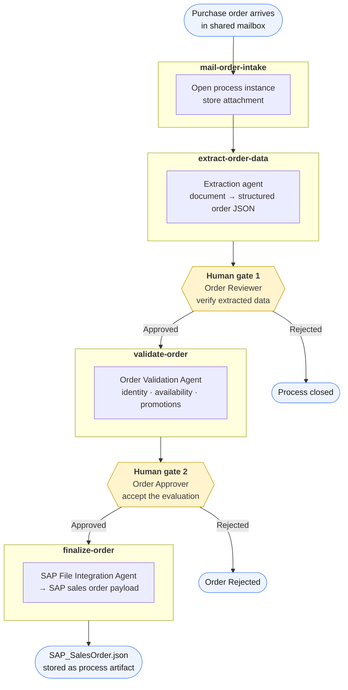
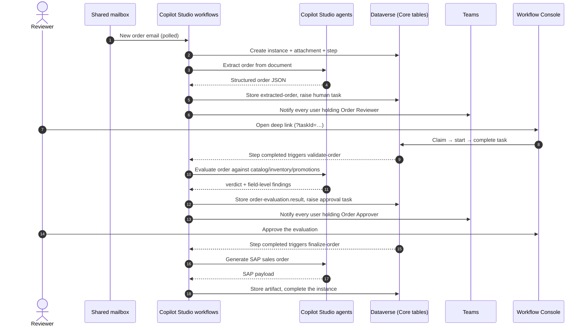

# Order Processing — reference implementation

A worked example of an agentic, long-running business process built on
[BusinessProcessCore](../../README.md#core-components).

Purchase orders arrive as email attachments — scans, PDFs, arbitrary layouts, any
language. Today someone opens each one, reads it, and re-keys it into the ERP. The cost
is not the typing: it is the SKU that does not exist, the quantity that is not in stock,
the promotion applied when it should not have been, and the absence of any record of who
approved what.

This process replaces re-keying with agentic extraction and policy validation, while
keeping two explicit human gates and a complete audit trail. Nothing about the
orchestration, the task queue, the review UI, or the audit trail is order-specific —
all of it comes from Core.

## Key features

Click to learn more about what this reference implementation adds on top of the core.

<b>Multilingual document extraction</b>

Purchase orders arrive as scans, PDFs, and arbitrary layouts in any language. An
extraction agent returns one fixed JSON contract — supplier, buyer, addresses, line
items, currency, totals, and its own confidence score — regardless of what the document
looked like.

<b>Policy validation from skills and knowledge files</b>

The validation agent runs three ordered agent skills, each backed by its own JSON
knowledge file: product identity against a catalog, availability against inventory, and
discount eligibility against promotion rules. It returns a verdict with field-level
findings — and deliberately never lets a pricing disagreement block an order.

<b>Two human gates, both deep-linked</b>

Reviewers verify what the agent read from the document; approvers accept or reject the
agent's evaluation. Both are notified in Teams with a link that opens the exact task in
the Workflow Console, where the source document sits beside the extracted data.

<b>Schema-bound SAP payload generation</b>

A final agent maps the approved order onto the SAP sales order shape, with a JSON Schema
as the single authority for field names, types, and formats, and explicit instructions to
omit what it cannot source rather than guess. The result is stored as a downloadable
process artifact.

## Process flow

Each box is a Copilot Studio workflow. No workflow calls the next one directly: every one
of them ends by writing a `faf001_bpstep` row to Dataverse, and the next workflow is
triggered by that row. A process can therefore sit for days between stages, survive a
failure at any point, and resume exactly where it stopped.

## Runtime interactions

## Stage by stage

### 1. Intake — `mail-order-intake`

Triggered by the Office 365 Outlook connector on mail arriving in the shared mailbox
named by the `faf001_OrderMailboxAddress` environment variable.

| Writes | Detail |
| --- | --- |
| `faf001_bpinstance` | Business key `sender\|subject`, channel *Email*, external initiator, start time from the mail |
| `faf001_bpattachment` | The order document itself, stored in Dataverse |
| `faf001_bpstep` | `Order Intake Validation`, then `Order Extraction Step` |

Creating the `Order Extraction Step` row is what starts the next stage.

### 2. Extraction — `extract-order-data`

Triggered by the creation of the `Order Extraction Step` row. Downloads the most recent
attachment and passes it to an agent node that returns a fixed JSON contract regardless
of the document's language or layout:

`supplier_name` · `supplier_code` · `supplier_address` · `supplier_contacts` ·
`buyer_name` · `buyer_code` · `buyer_address` · `delivery_address` · `buyer_contacts` ·
`order_id` · `order_date` · `currency` · `order_total` ·
`line_items[]` (`line_number`, `sku`, `product_description`, `quantity`,
`unit_of_measure`, `unit_price`, `total_price`) · `additional_info[]` ·
`extraction_confidence`

The result is stored as the `extracted-order` process data value. The flow then raises
the `Extracted Order Data Review` human task with widget `extracted-order-review-ui`,
routed to the **Order Reviewer** security role.

### 3. Human gate 1 — verify what the agent read

The flow resolves the role by name, selects every enabled user who holds it directly,
inherits it through a team, or belongs to the `Order Reviewers Global` team, and sends
each one a Teams message containing a Workflow Console link with the task ID appended.

In the console the reviewer sees the source document beside the extracted fields, can
correct any value, and approves or rejects. Completing the task writes the decision and
the corrected order back as process data values and closes the step — which triggers the
next flow.

### 4. Validation — `validate-order`

Triggered by completion of the `Extracted Order Data Review` step. Reads the reviewer's
decision, and on approval creates the `Order Evaluation` step and calls the
**Order Validation Agent**.

The agent's findings are stored as the `order-evaluation.result` data value, and the
flow raises the `Order Evaluation Review` human task with widget
`order-evaluation-review-ui`, routed to the **Order Approver** role and the
`Order Approvers Global` team, with the same Teams notification pattern.

### 5. Human gate 2 — accept the evaluation

The approver sees the agent's verdict, its reasoning, its confidence, and the per-field
findings — not an opaque score. Approving closes the step and triggers finalization.

### 6. Finalization — `finalize-order`

Triggered by completion of the `Order Evaluation Review` step. On rejection it writes an
`Order Rejected` step and closes the instance. On approval it writes `Order Validated`,
then `Generate SAP order payload`, and calls the **SAP File Integration Agent**.

The generated payload is stored as a `faf001_bpartifact` named
`SAP_SalesOrder_<customer PO>.json`, downloadable from the Workflow Console, and the
process instance is completed.

## The agents

Both agents are Copilot Studio agents built with the **GitHub Copilot harness**, which is
what lets them be authored as ordered *agent skills* with their own knowledge files
instead of one monolithic prompt. The extraction step in `extract-order-data` runs on the
same harness through an agent node in the flow.

### Order Validation Agent — `faf001_ordervalidationagent`

A Copilot Studio agent that runs three [agent skills](https://learn.microsoft.com/microsoft-copilot-studio/agents-experience/skills-overview)
in order, each backed by its own JSON knowledge file:

| Skill | Checks | Reference data |
| --- | --- | --- |
| `validate-order-product-identity` | SKU, barcode, and description resolve to a real product; aliases and conflicting identifiers reconciled | `catalog.json` |
| `validate-order-product-availability` | Requested quantities are fulfillable now — single warehouse, no backorders, no partial fulfilment, repeated SKUs aggregated | `inventory.json` |
| `evaluate-order-discounts-promotions` | Buyer and supplier eligibility, date windows, currency, quantity and spend thresholds, non-stacking rules, proposed adjustments | `promotions.json` |

It returns a single JSON object: `verdict`, `reasoning`, `confidence`, and
`field_results` — one entry per input path such as `/lines/0/sku`, each with a status
and a reason naming the responsible skill.

One design decision is worth calling out: **the verdict is `pass` only when product
identity and availability both pass.** Promotion findings are always reported but never
change the verdict. Pricing disagreements are a commercial conversation, not a reason to
block an order — and encoding that distinction in the agent's instructions is cheaper
than encoding it in a flow.

### SAP File Integration Agent — `faf001_sapfileintegrationagent`

Maps an approved order onto the SAP sales order shape (`A_SalesOrder` /
`A_SalesOrderItem` from `API_SALES_ORDER_SRV`). It ships two skills, `sap-order-json`
and `sap-order-excel`, sharing one authority — `sap-sales-order.schema.json` — which
defines every field name, type, length, and pattern. The skill instructions forbid
inventing a field that is not in the schema, and specify the normalisation rules:
customer and material numbers zero-padded, dates to `YYYY-MM-DD`, quantities to three
decimals, units and currencies mapped to their codes, optional fields omitted rather
than guessed.

The flow uses the JSON skill and stores the result as a process artifact.

## What this process contributes, and what it inherits

| Contributed by Order Processing | Inherited from Core |
| --- | --- |
| 4 Copilot Studio workflows | Process instance, step, task, attachment, artifact, and data value tables |
| 2 Copilot Studio agents with 5 skills and 5 knowledge files | Task lifecycle API — claim, start, transactional complete |
| 2 review widgets (`extracted-order-review-ui`, `order-evaluation-review-ui`) | Workflow Console — task queue, task detail, instance timeline, artifact download |
| 2 security roles (`Order Reviewer`, `Order Approver`) | Role-based task routing and Teams notification pattern |
| 1 environment variable (`faf001_OrderMailboxAddress`) | Console deep-link variable, monitoring agent, audit trail |

Adding a second process — claims, loans, onboarding — means producing the left column
only.

## Demo data and limits

- `catalog.json`, `inventory.json`, and `promotions.json` are **fictional demo data**
  shipped as agent knowledge files. Point the skills at real product, stock, and pricing
  services before using this for anything real.
- The SAP agent **generates a payload; it does not post it.** There is no ERP connection
  in this sample. Adding one is a single additional action in `finalize-order`.
- Availability assumes one warehouse and immediate fulfilment. Backorders and partial
  fulfilment are deliberately out of scope.

## Before you deploy

This process assumes **BusinessProcessCore is already installed** in the target
environment, with its access and licensing in place — see
[Quick deploy](../../README.md#quick-deploy). On top of that, it needs the following.

| Additional access | Needed for |
| --- | --- |
| **User Administrator** (Microsoft 365) | Creating the automation account and assigning its licences |
| **Exchange Administrator** (Microsoft 365) | Creating the shared mailbox that receives orders and delegating it to the automation account |

| Additional licence | Who needs it |
| --- | --- |
| **Exchange Online** | The automation account, for the mailbox connection |
| **Microsoft Teams** | The automation account, for task notifications; reviewers and approvers, to receive them |
| **Copilot Studio user licence** | The automation account, for the agent connection |
| **Power Apps Premium** | Reviewers and approvers, to use the Workflow Console |

You will also need:

- a **shared mailbox** to receive incoming orders — new or existing — with Full Access
  and Send As granted to the automation account;
- an **automation account**: a dedicated user whose Outlook, Teams, and agent connections
  the workflows run under;
- **reviewers and approvers** assigned to the `Order Reviewer` and `Order Approver`
  security roles, or to the `Order Reviewers Global` and `Order Approvers Global` teams.

Running the agents and workflows consumes **Copilot Credits**.

## Deploy

Ask GitHub Copilot to run the `deploy-order-processing` skill from this repository: it
verifies the core installation, provisions the automation identity and mailbox, imports
the solution, activates its workflows, and assigns the roles — stopping for your
confirmation before any of it. The same steps are written out in the
[OrderProcessing deployment guide](solution/DEPLOYMENT.md).
