# Business Process — Dataverse Data Model Specification

Design specification for the tables that track business process instance execution, their steps, human tasks, attachments, artifacts, and data values.

| Field | Value |
| --- | --- |
| Solution | `business_process_core`  |
| Publisher prefix | `faf001` |
| Option value prefix | `32401` |
| Tables | 6 |
| Global choices | 14 |
| Relationships | 20 |
| Alternate keys | 1 |

## Conventions

- Every schema name is prefixed `faf001_`; display names are separate and localizable.
- Each table's GUID primary key is the platform-generated `faf001_<table>id` column and is never declared explicitly.
- The primary **name** column is chosen deliberately and cannot be changed after creation.
- All tables are **User/Team owned** so that parental cascades can propagate assignment and sharing from the instance down.
- Choices are defined as **global** option sets because status and type values are reused across tables.
- `Multiline Text` lengths are stated explicitly; the Dataverse default of 2,000 is not assumed.

## Table index

| # | Display name | Schema name | Primary name column | Purpose |
| --- | --- | --- | --- | --- |
| 1 | Business Process Instance | `faf001_bpinstance` | `faf001_processname` | One execution of a business process. Root record. |
| 2 | Process Step Execution | `faf001_bpstep` | `faf001_stepname` | One executed step inside an instance. |
| 3 | Process Human Task | `faf001_bptask` | `faf001_taskname` | Work assigned to a person or team. |
| 4 | Process Attachment | `faf001_bpattachment` | `faf001_filename` | Binary content coming *into* the process. |
| 5 | Process Artifact | `faf001_bpartifact` | `faf001_artifactname` | Content *produced by* the process. |
| 6 | Process Data Value | `faf001_bpdatavalue` | `faf001_datakey` | Typed key/value data: process-global objects, step outputs, task outputs. |

---

## 1. Business Process Instance — `faf001_bpinstance`

Ownership: User/Team owned. Primary name column: `faf001_processname`.

| Group | Display name | Schema name | Type | Required |
| --- | --- | --- | --- | --- |
| Identity | Process Name | `faf001_processname` | Text(100) | **Primary name**, Required |
| Identity | Process Description | `faf001_processdescription` | Text(200) | Optional |
| Identity | Process Version | `faf001_processversion` | Text(20) | Optional |
| Identity | Business Key | `faf001_businesskey` | Text(850) | Optional |
| Lifecycle | Status | `faf001_status` | Choice `faf001_bpinstancestatus` | Required |
| Lifecycle | Status Message | `faf001_statusmessage` | Text(200) | Optional |
| Lifecycle | Priority | `faf001_priority` | Choice `faf001_bppriority` | Optional |
| Lifecycle | Start Time | `faf001_starttime` | DateTime | Optional |
| Lifecycle | End Time | `faf001_endtime` | DateTime | Optional |
| Lifecycle | Due Date | `faf001_duedate` | DateTime | Optional |
| Lifecycle | Last Updated | `faf001_lastupdated` | DateTime | Optional |
| Progress | Last Completed Step | `faf001_lastcompletedstepid` | Lookup → `faf001_bpstep` | Optional |
| Outcome | Error Code | `faf001_errorcode` | Text(100) | Optional |
| Outcome | Error Message | `faf001_errormessage` | Multiline Text(4000) | Optional |
| Origin | Channel | `faf001_channel` | Choice `faf001_bpchannel` | Optional |
| Origin | Initiated By | `faf001_initiatedby` | Lookup → `systemuser` | Optional |
| Origin | Initiator (External) | `faf001_initiatorexternal` | Text(200) | Optional |

Design decisions:

- The platform-generated `faf001_bpinstanceid` GUID is the identifier; no additional `Unique Identifier` column and no autonumber column were added.
- `faf001_status` is a custom choice rather than the built-in `statecode`/`statuscode`, so process states can evolve without touching the built-in state model.
- `faf001_businesskey` is 850 characters rather than the usual 100 because callers compose it from external correlation IDs that can be long. `mail-order-intake` builds it as `<from>|<subject>`, which fits comfortably; the headroom remains because 850 also stays inside the 900-byte index budget in case the column later needs an alternate key. **This key is descriptive, not unique** - two orders from the same sender under the same subject produce the same value, so it identifies a conversation rather than a run. The instance GUID remains the only identifier.
- `faf001_statusmessage` carries the human-readable *why* behind `faf001_status`, which on its own only says *where* the run is. It is not an error channel: `faf001_errorcode` and `faf001_errormessage` stay reserved for failures, so an instance can be Completed with a status message and no error.
- `faf001_lastupdated` records when a workflow last advanced the process. The platform's `modifiedon` cannot serve this purpose because it moves on every touch of the row, including ones that change nothing about process state.
- **Every flow writes both columns immediately after each `faf001_bpstep` write**, so the instance always explains where the run is without a reader having to open its step list. The step write comes first and the instance write reports it, so the status message is never ahead of the step it describes.
- Input and output payloads are not stored here; they belong in `faf001_bpdatavalue`.

---

## 2. Process Step Execution — `faf001_bpstep`

Ownership: User/Team owned. Primary name column: `faf001_stepname`.

| Group | Display name | Schema name | Type | Required |
| --- | --- | --- | --- | --- |
| Identity | Step Name | `faf001_stepname` | Text(100) | **Primary name**, Required |
| Identity | Step Type | `faf001_steptype` | Choice `faf001_bpsteptype` | Optional |
| Relation | Business Process Instance | `faf001_bpinstanceid` | Lookup → `faf001_bpinstance` | Required |
| Relation | Flow Run | `faf001_flowrunid` | Lookup → `flowrun` | Optional |
| Lifecycle | Status | `faf001_status` | Choice `faf001_bpstepstatus` | Required |
| Lifecycle | Start Time | `faf001_starttime` | DateTime | Optional |
| Lifecycle | End Time | `faf001_endtime` | DateTime | Optional |
| Outcome | Error Code | `faf001_errorcode` | Text(100) | Optional |
| Outcome | Error Message | `faf001_errormessage` | Multiline Text(4000) | Optional |
| Execution | Executed By | `faf001_executedby` | Lookup → `systemuser` | Optional |

**Flow Run lookup.** `flowrun` is a platform-managed system table. It is not customizable, but it is valid as the referenced side of a 1:N relationship, and the lookup attribute is created on `faf001_bpstep` rather than on `flowrun`, so the relationship is supported.

One behavior is inherent to the design: rows in `flowrun` are retention-managed by Power Automate, so a flow run record can be purged while the step record survives, after which the lookup reads as empty. Where a permanent reference is required, carry the flow run ID in a text column instead.

---

## 3. Process Human Task — `faf001_bptask`

Ownership: User/Team owned. Primary name column: `faf001_taskname`.

| Group | Display name | Schema name | Type | Required |
| --- | --- | --- | --- | --- |
| Identity | Task Name | `faf001_taskname` | Text(200) | **Primary name**, Required |
| Identity | Task Type | `faf001_tasktype` | Choice `faf001_bptasktype` | Optional |
| Relation | Business Process Instance | `faf001_bpinstanceid` | Lookup → `faf001_bpinstance` | Required |
| Relation | Process Step | `faf001_bpstepid` | Lookup → `faf001_bpstep` | Optional |
| Assignment | Assigned To | `faf001_assignedto` | Lookup → `systemuser` | Optional |
| Assignment | Assigned Team | `faf001_assignedteam` | Lookup → `team` | Optional |
| Assignment | Required Role | `faf001_requiredrole` | Lookup → `role` | Optional |
| Assignment | Assigned On | `faf001_assignedon` | DateTime | Optional |
| Lifecycle | Status | `faf001_status` | Choice `faf001_bptaskstatus` | Required |
| Lifecycle | Due Date | `faf001_duedate` | DateTime | Optional |
| Lifecycle | Completed On | `faf001_completedon` | DateTime | Optional |
| UI | Input Data | `faf001_inputdata` | Multiline Text(100000), JSON | Optional |
| UI | Widget ID | `faf001_widgetid` | Text(100) | Optional |
| Outcome | Outcome | `faf001_outcome` | Choice `faf001_bptaskoutcome` | Optional |
| Outcome | Comments | `faf001_comments` | Multiline Text(4000) | Optional |

Design decisions:

- `faf001_inputdata` carries the JSON payload the UI renders for the user.
- `faf001_widgetid` names the UI component used to present the task. It applies when `faf001_tasktype` is `Custom`. **No business rule enforces this** — it is a writer-side convention by explicit decision.
- Task **output** is not stored on this table. It is written to `faf001_bpdatavalue` records that reference the instance, the step, and the task.
- `Status` (where the task is) and `Outcome` (what the human decided) are deliberately separate columns.
- `Assigned To` and `Assigned Team` are explicit lookups so that "who must act" stays distinct from `ownerid`, "who owns the record".
- `Required Role` routes a task to a **capability** rather than a named person or team. The three assignment paths are additive: a task reaches a user if it is assigned to them, to one of their teams, or carries a role they hold. See [App-specific security roles](#app-specific-security-roles).

---

## 4. Process Attachment — `faf001_bpattachment`

Ownership: User/Team owned. Primary name column: `faf001_filename`.

| Group | Display name | Schema name | Type | Required |
| --- | --- | --- | --- | --- |
| Identity | File Name | `faf001_filename` | Text(200) | **Primary name**, Required |
| Identity | Description | `faf001_description` | Multiline Text(2000) | Optional |
| Identity | Attachment Type | `faf001_attachmenttype` | Choice `faf001_bpattachmenttype` | Optional |
| Relation | Business Process Instance | `faf001_bpinstanceid` | Lookup → `faf001_bpinstance` | Optional |
| Relation | Process Step | `faf001_bpstepid` | Lookup → `faf001_bpstep` | Optional |
| Relation | Process Human Task | `faf001_bptaskid` | Lookup → `faf001_bptask` | Optional |
| Content | File | `faf001_file` | File | Optional |
| Content | External URL | `faf001_externalurl` | URL(500) | Optional |
| Content | MIME Type | `faf001_mimetype` | Text(100) | Optional |
| Content | File Size (bytes) | `faf001_filesize` | Whole Number | Optional |
| Content | Storage Type | `faf001_storagetype` | Choice `faf001_bpstoragetype` | Optional |
| Source | Source | `faf001_source` | Choice `faf001_bpattachmentsource` | Optional |
| Source | Received On | `faf001_receivedon` | DateTime | Optional |

Design decisions:

- Both `faf001_file` (bytes in Dataverse, consumes File capacity) and `faf001_externalurl` (bytes elsewhere, metadata only in Dataverse) exist. **Mixed usage is intended**; no single default is mandated.
- `faf001_source` is *where the file came from*; `faf001_storagetype` is *where the bytes live now*. They are independent.
- `faf001_bpinstanceid` is **optional here and required on every other child table**. An intake process that derives the instance business key from the attachment has to create the attachment row before the instance exists, and this column is what lets it. An optional lookup on a parental relationship is supported — the platform's own activity `regardingobjectid` has the same shape. The cost is that an attachment left unlinked is outside the instance cascade and will not be deleted with the run, so writers are expected to set the lookup as soon as the instance exists. Writers that create the instance first should populate the lookup on create.

---

## 5. Process Artifact — `faf001_bpartifact`

Ownership: User/Team owned. Primary name column: `faf001_artifactname`.

| Group | Display name | Schema name | Type | Required |
| --- | --- | --- | --- | --- |
| Identity | Artifact Name | `faf001_artifactname` | Text(200) | **Primary name**, Required |
| Identity | Description | `faf001_description` | Multiline Text(2000) | Optional |
| Identity | Artifact Type | `faf001_artifacttype` | Choice `faf001_bpartifacttype` | Optional |
| Identity | Version | `faf001_version` | Whole Number | Optional |
| Relation | Business Process Instance | `faf001_bpinstanceid` | Lookup → `faf001_bpinstance` | Required |
| Relation | Process Step | `faf001_bpstepid` | Lookup → `faf001_bpstep` | Optional |
| Relation | Supersedes | `faf001_supersedesid` | Lookup → `faf001_bpartifact` | Optional |
| Content | File | `faf001_file` | File | Optional |
| Content | External URL | `faf001_externalurl` | URL(500) | Optional |
| Content | MIME Type | `faf001_mimetype` | Text(100) | Optional |
| Content | File Size (bytes) | `faf001_filesize` | Whole Number | Optional |
| Content | Storage Type | `faf001_storagetype` | Choice `faf001_bpstoragetype` | Optional |
| Generation | Status | `faf001_status` | Choice `faf001_bpartifactstatus` | Optional |
| Generation | Generated On | `faf001_generatedon` | DateTime | Optional |
| Generation | Generated By | `faf001_generatedby` | Lookup → `systemuser` | Optional |

Design decisions:

- `Version` plus the self-referencing `Supersedes` lookup is what separates artifacts from attachments: artifacts get regenerated, incoming files do not.
- `Generated By` is a `systemuser` lookup and therefore does not capture agent or flow authorship. `faf001_bpstepid` provides that context instead.

---

## 6. Process Data Value — `faf001_bpdatavalue`

Ownership: User/Team owned. Primary name column: `faf001_datakey`.

| Group | Display name | Schema name | Type | Required |
| --- | --- | --- | --- | --- |
| Identity | Data Key | `faf001_datakey` | Text(100) | **Primary name**, Required |
| Identity | Data Type | `faf001_datatype` | Choice `faf001_bpdatatype` | Required |
| Identity | Description | `faf001_description` | Text(500) | Optional |
| Relation | Business Process Instance | `faf001_bpinstanceid` | Lookup → `faf001_bpinstance` | Required |
| Relation | Process Step | `faf001_bpstepid` | Lookup → `faf001_bpstep` | Optional |
| Relation | Process Human Task | `faf001_bptaskid` | Lookup → `faf001_bptask` | Optional |
| Value | Value (Text) | `faf001_valuetext` | Multiline Text(4000) | Optional |
| Value | Value (Number) | `faf001_valuenumber` | Decimal, 10 decimal places | Optional |
| Value | Value (Boolean) | `faf001_valueboolean` | Yes/No | Optional |
| Value | Value (DateTime) | `faf001_valuedatetime` | DateTime | Optional |
| Value | Value (JSON) | `faf001_valuejson` | Multiline Text(100000) | Optional |

### Alternate key

| Key name | Columns | Effect |
| --- | --- | --- |
| `faf001_bpdatavalue_key` | `faf001_bpinstanceid`, `faf001_datakey` | One value per key per process instance. Enables `Upsert` by business key without a pre-read. |

The key deliberately excludes `faf001_bpstepid` and `faf001_bptaskid`. Both are optional, and an alternate key is backed by a unique index in which NULLs compare equal — including a nullable lookup would allow only one row with an empty value and break on the second write.

### Key namespace convention

There is no `Scope` column. Because keys are unique per instance, global data, step outputs, and task outputs share one namespace and are disambiguated by naming convention:

```text
orderTotal                    process-global value
validate-order.isValid        step output
approval-task.decision        task output
```

The Step and Task lookups remain on the record as queryable context; they are simply not part of the record identity.

### Value column convention

`faf001_datatype` tells consumers which `Value (…)` column to read. Exactly one value column should be populated per record. This is a writer-side convention and is **not** enforced by schema. A `Reference` value is stored in `faf001_valuetext` as `entityname:guid`; no polymorphic lookup is used.

Markdown uses datatype `324010006` and stores source in `faf001_valuetext`. JSON uses
`324010004` and `faf001_valuejson`. Consumers can render these formats while retaining
the original source for inspection and download; no additional type column is required.

---

## Global choices

Fourteen global option sets. Option values are allocated by the platform under option value prefix `32401`.

| Schema name | Values |
| --- | --- |
| `faf001_bpinstancestatus` | Not Started, Running, Waiting, Suspended, Completed, Failed, Cancelled, Compensating |
| `faf001_bppriority` | Low, Normal, High, Critical |
| `faf001_bpchannel` | Copilot Agent, Cloud Flow, API, Manual, Scheduled, External System |
| `faf001_bpstepstatus` | Not Started, Running, Waiting, Completed, Failed, Skipped, Cancelled |
| `faf001_bpsteptype` | Automated, Human Task, Decision, Integration, Notification, Sub-Process, AI / Agent |
| `faf001_bptaskstatus` | Not Started, Assigned, In Progress, Waiting, Completed, Cancelled, Expired |
| `faf001_bptasktype` | Approval, Data Review, Data Entry, Custom |
| `faf001_bptaskoutcome` | Approved, Rejected, Needs More Info, Escalated, Completed, No Response |
| `faf001_bpattachmenttype` | Document, Image, Email, Data File, Other |
| `faf001_bpattachmentsource` | Email, User Upload, SharePoint, Blob Storage, API, External System |
| `faf001_bpartifacttype` | Generated Document, Report, Extracted Data, AI Output, Log, Export, Other |
| `faf001_bpartifactstatus` | Draft, Final, Superseded, Archived |
| `faf001_bpstoragetype` | OneDrive, SharePoint, Dataverse, Azure Blob Storage, Other |
| `faf001_bpdatatype` | Text, Number, Boolean, DateTime, JSON, Reference, Markdown |

---

## App-specific security roles

Application roles are modelled as **Dataverse security roles**, not as a custom table. Administrators create the role and assign it to teams in the Power Platform admin UI; there is no in-app administration surface.

| Role name | Purpose | Set by |
| --- | --- | --- |
| `Order Reviewer` | May review and act on the extracted-order review task. | `extract-order-data` flow, on `faf001_requiredrole` |
| `Order Approver` | May approve or reject the agent's order evaluation. | `validate-order` flow, on `faf001_requiredrole` |

Conventions and constraints:

- **Resolve roles by name, never by GUID.** Role ids are environment-specific, so committing one would violate the "no environment-bound values in source" rule. The flow reads `roles?$filter=name eq '<role>'` at runtime. The name is hardcoded in the flow generator that raises the task.
- **Notify every eligible recipient once.** After creating a human task, the raising flow uses one distinct FetchXML query to select enabled users who hold the task's role directly, inherit it through any team, or belong to a named team. It sends each selected user a direct Flow bot message in Teams using the user's internal email address. `extract-order-data` notifies `Order Reviewer` / `Order Reviewers Global`; `validate-order` notifies `Order Approver` / `Order Approvers`.
- **Externalize the console URL.** The solution environment variable `faf001_WorkflowConsoleBaseUrl` holds the Workflow Console launch URL. Its source default launches the local development app through Power Apps; deployments may override it with an environment-specific current value. The flow reads the current/default value from the Dataverse environment-variable tables at runtime, appends `taskId=<created task id>`, and the code app opens `/tasks/:taskId`.
- **A missing role does not fail the run.** The bind is wrapped in `if(empty(...), null, ...)`, so an unresolvable role leaves the task unrouted rather than aborting extraction.
- **Use dedicated custom roles.** Built-in roles such as `Basic User` are held by nearly every team, so tagging a task with one would expose it to the whole organisation.
- **A security role is not row access.** `faf001_requiredrole` only drives which tasks the client *lists*. Reading and updating the task row still depends on ordinary Dataverse privileges. The same custom role should therefore also grant:
  - Read on **Security Role**, **Team**, and **Team Membership** — the app resolves the caller's roles by joining `teammembership` → `team` → `teamroles` → `role`, and without these privileges that query returns nothing and role-routed tasks silently disappear from the queue;
  - the appropriate privileges on the `faf001_bp*` tables, or the app will list tasks the user cannot open.
- **Single business unit assumption.** Dataverse replicates every security role per business unit, so in a multi-BU organisation `name eq '<role>'` returns one row per unit with different `roleid`, and a task tagged with one unit's copy will not match a user holding another's. This model assumes a single business unit; supporting more means comparing on `_parentrootroleid_value` instead of `roleid`.

---

## Relationships

All relationships are 1:N. No many-to-many relationships are required.

### Instance-rooted — parental

Behavior: Delete `Cascade All`; Assign, Share, Unshare `Cascade All`; Reparent `Cascade None`. Deleting a run removes its entire trace, and reassigning the instance moves ownership of everything beneath it.

| Relationship | Parent | Child | Lookup column |
| --- | --- | --- | --- |
| `faf001_bpinstance_bpstep` | `faf001_bpinstance` | `faf001_bpstep` | `faf001_bpinstanceid` (Required) |
| `faf001_bpinstance_bptask` | `faf001_bpinstance` | `faf001_bptask` | `faf001_bpinstanceid` (Required) |
| `faf001_bpinstance_bpattachment` | `faf001_bpinstance` | `faf001_bpattachment` | `faf001_bpinstanceid` (Optional) |
| `faf001_bpinstance_bpartifact` | `faf001_bpinstance` | `faf001_bpartifact` | `faf001_bpinstanceid` (Required) |
| `faf001_bpinstance_bpdatavalue` | `faf001_bpinstance` | `faf001_bpdatavalue` | `faf001_bpinstanceid` (Required) |

### Step and task context — referential, restrict delete

A step or task that still has evidence attached cannot be deleted on its own; the instance-level cascade above still removes everything when the run is deleted.

| Relationship | Parent | Child | Lookup column |
| --- | --- | --- | --- |
| `faf001_bpstep_bptask` | `faf001_bpstep` | `faf001_bptask` | `faf001_bpstepid` |
| `faf001_bpstep_bpattachment` | `faf001_bpstep` | `faf001_bpattachment` | `faf001_bpstepid` |
| `faf001_bpstep_bpartifact` | `faf001_bpstep` | `faf001_bpartifact` | `faf001_bpstepid` |
| `faf001_bpstep_bpdatavalue` | `faf001_bpstep` | `faf001_bpdatavalue` | `faf001_bpstepid` |
| `faf001_bptask_bpattachment` | `faf001_bptask` | `faf001_bpattachment` | `faf001_bptaskid` |
| `faf001_bptask_bpdatavalue` | `faf001_bptask` | `faf001_bpdatavalue` | `faf001_bptaskid` |

### Cross-table and system — referential, remove link

| Relationship | Parent | Child | Lookup column |
| --- | --- | --- | --- |
| `faf001_bpinstance_lastcompletedstep` | `faf001_bpstep` | `faf001_bpinstance` | `faf001_lastcompletedstepid` |
| `faf001_bpartifact_supersedes` | `faf001_bpartifact` | `faf001_bpartifact` | `faf001_supersedesid` |
| `faf001_flowrun_bpstep` | `flowrun` | `faf001_bpstep` | `faf001_flowrunid` |
| `faf001_systemuser_bpinstance_initiatedby` | `systemuser` | `faf001_bpinstance` | `faf001_initiatedby` |
| `faf001_systemuser_bpstep_executedby` | `systemuser` | `faf001_bpstep` | `faf001_executedby` |
| `faf001_systemuser_bptask_assignedto` | `systemuser` | `faf001_bptask` | `faf001_assignedto` |
| `faf001_team_bptask_assignedteam` | `team` | `faf001_bptask` | `faf001_assignedteam` |
| `faf001_role_bptask_requiredrole` | `role` | `faf001_bptask` | `faf001_requiredrole` |
| `faf001_systemuser_bpartifact_generatedby` | `systemuser` | `faf001_bpartifact` | `faf001_generatedby` |

### Circular reference

`faf001_bpinstance_lastcompletedstep` points Instance → Step while `faf001_bpinstance_bpstep` points Step → Instance. This cycle is intentional but has two consequences:

1. Creation order matters: create the step first, then update the instance's `Last Completed Step`.
2. `Restrict Delete` on the step relationship combined with this lookup could block deletes, which is why this relationship uses `Remove Link`.

---

## ER diagram

```mermaid
erDiagram
    BPINSTANCE ||--o{ BPSTEP : "steps (cascade)"
    BPINSTANCE ||--o{ BPTASK : "tasks (cascade)"
    BPINSTANCE ||--o{ BPATTACHMENT : "attachments (cascade)"
    BPINSTANCE ||--o{ BPARTIFACT : "artifacts (cascade)"
    BPINSTANCE ||--o{ BPDATAVALUE : "data values (cascade)"

    BPSTEP ||--o{ BPTASK : "raises"
    BPSTEP ||--o{ BPATTACHMENT : "consumes"
    BPSTEP ||--o{ BPARTIFACT : "produces"
    BPSTEP ||--o{ BPDATAVALUE : "outputs"

    BPTASK ||--o{ BPATTACHMENT : "attaches"
    BPTASK ||--o{ BPDATAVALUE : "outputs"

    BPSTEP |o--o| BPINSTANCE : "last completed step"
    BPARTIFACT |o--o| BPARTIFACT : "supersedes"
    FLOWRUN ||--o{ BPSTEP : "flow run"

    SYSTEMUSER ||--o{ BPINSTANCE : "initiated by"
    SYSTEMUSER ||--o{ BPSTEP : "executed by"
    SYSTEMUSER ||--o{ BPTASK : "assigned to"
    SYSTEMUSER ||--o{ BPARTIFACT : "generated by"
    TEAM ||--o{ BPTASK : "assigned team"
    ROLE ||--o{ BPTASK : "required role"

    BPINSTANCE {
        guid faf001_bpinstanceid PK
        string faf001_processname "primary name"
        string faf001_processdescription
        string faf001_processversion
        string faf001_businesskey
        choice faf001_status
        string faf001_statusmessage
        choice faf001_priority
        datetime faf001_starttime
        datetime faf001_endtime
        datetime faf001_duedate
        datetime faf001_lastupdated
        lookup faf001_lastcompletedstepid FK
        string faf001_errorcode
        string faf001_errormessage
        choice faf001_channel
        lookup faf001_initiatedby FK
        string faf001_initiatorexternal
    }

    BPSTEP {
        guid faf001_bpstepid PK
        string faf001_stepname "primary name"
        choice faf001_steptype
        lookup faf001_bpinstanceid FK
        lookup faf001_flowrunid FK
        choice faf001_status
        datetime faf001_starttime
        datetime faf001_endtime
        string faf001_errorcode
        string faf001_errormessage
        lookup faf001_executedby FK
    }

    BPTASK {
        guid faf001_bptaskid PK
        string faf001_taskname "primary name"
        choice faf001_tasktype
        lookup faf001_bpinstanceid FK
        lookup faf001_bpstepid FK
        lookup faf001_assignedto FK
        lookup faf001_assignedteam FK
        lookup faf001_requiredrole FK
        datetime faf001_assignedon
        choice faf001_status
        datetime faf001_duedate
        datetime faf001_completedon
        string faf001_inputdata "JSON"
        string faf001_widgetid
        choice faf001_outcome
        string faf001_comments
    }

    BPATTACHMENT {
        guid faf001_bpattachmentid PK
        string faf001_filename "primary name"
        string faf001_description
        choice faf001_attachmenttype
        lookup faf001_bpinstanceid FK
        lookup faf001_bpstepid FK
        lookup faf001_bptaskid FK
        file faf001_file
        url faf001_externalurl
        string faf001_mimetype
        int faf001_filesize
        choice faf001_storagetype
        choice faf001_source
        datetime faf001_receivedon
    }

    BPARTIFACT {
        guid faf001_bpartifactid PK
        string faf001_artifactname "primary name"
        string faf001_description
        choice faf001_artifacttype
        int faf001_version
        lookup faf001_bpinstanceid FK
        lookup faf001_bpstepid FK
        lookup faf001_supersedesid FK
        file faf001_file
        url faf001_externalurl
        string faf001_mimetype
        int faf001_filesize
        choice faf001_storagetype
        choice faf001_status
        datetime faf001_generatedon
        lookup faf001_generatedby FK
    }

    BPDATAVALUE {
        guid faf001_bpdatavalueid PK
        string faf001_datakey "primary name, AK"
        choice faf001_datatype
        string faf001_description
        lookup faf001_bpinstanceid FK "AK"
        lookup faf001_bpstepid FK
        lookup faf001_bptaskid FK
        string faf001_valuetext
        decimal faf001_valuenumber
        boolean faf001_valueboolean
        datetime faf001_valuedatetime
        string faf001_valuejson
    }
```



---

## Creation order

Dependencies require this sequence:

1. All 14 global choices.
2. `faf001_bpinstance` — without `faf001_lastcompletedstepid`.
3. `faf001_bpstep` — including `faf001_bpinstanceid` and `faf001_flowrunid`.
4. `faf001_bpinstance.faf001_lastcompletedstepid` — added once `faf001_bpstep` exists, closing the cycle.
5. `faf001_bptask`.
6. `faf001_bpattachment` and `faf001_bpartifact`.
7. `faf001_bpdatavalue`, then its alternate key `faf001_bpdatavalue_key`.

## Design considerations left open

| # | Item | Note |
| --- | --- | --- |
| 1 | Dataverse File capacity | `faf001_file` consumes File capacity. Confirm headroom, or prefer `faf001_externalurl` with external storage. |
| 2 | Record volume and retention | No retention or archival strategy is defined. High step and data value volumes may warrant one. |
| 3 | Model-driven forms and views | Out of scope for this specification; none are defined. |
| 4 | Value column exclusivity | "Exactly one `Value (…)` column populated per record" is a writer-side convention, unenforced by schema. |
| 5 | Widget ID applicability | `faf001_widgetid` applies when Task Type is `Custom`; deliberately not enforced by a business rule. |
